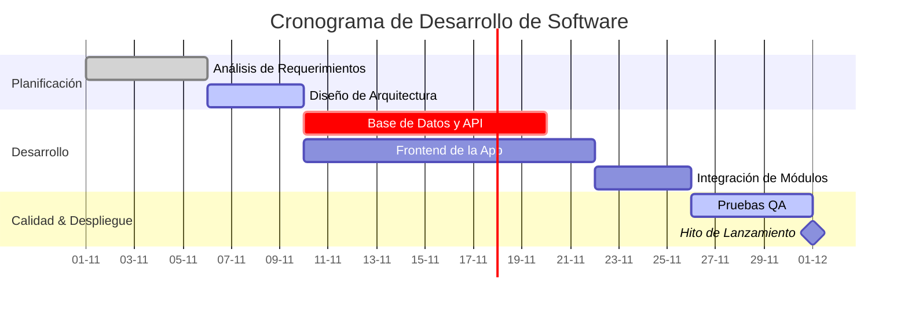

# prueba

```mermaid
gantt
    title Cronograma de Desarrollo de Software
    dateFormat  YYYY-MM-DD
    axisFormat  %d-%m
    
    section Planificación
    Análisis de Requerimientos :done, req1, 2026-11-01, 5d
    Diseño de Arquitectura     :active, req2, after req1, 4d

    section Desarrollo
    Base de Datos y API       :crit, dev1, after req2, 10d
    Frontend de la App        :dev2, after req2, 12d
    Integración de Módulos    :dev3, after dev1 dev2, 4d

    section Calidad & Despliegue
    Pruebas QA                 :active, qa1, after dev3, 5d
    Hito de Lanzamiento        :milestone, after qa1, 0d
```
